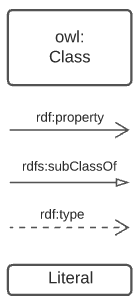
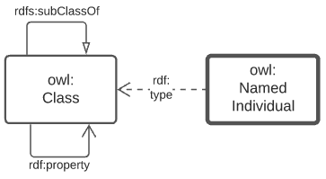
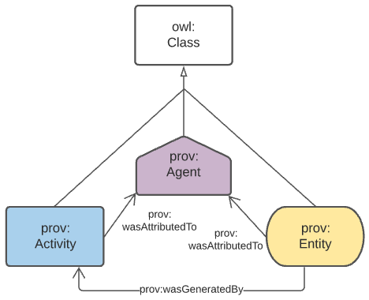
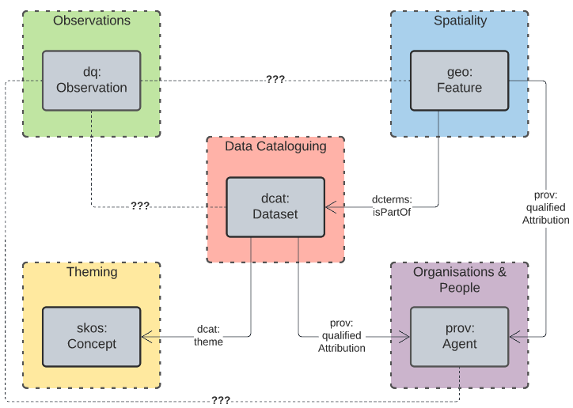
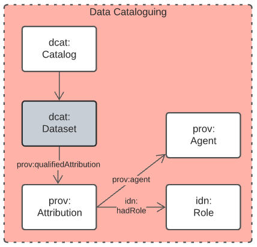
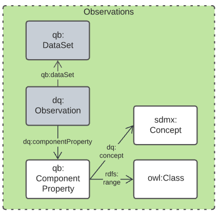
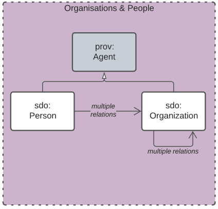

= Indigenous Data Network Supermodel Specification
:toc: left
:table-stripes: even
:sectnums:

== Metadata

[width=75%, frame=none, grid=none, cols="1,5"]
|===
|**IRI** | https://linked.data.gov.au/def/idn-supermodel 

_Note the IRI for this data model being in a gov.au domain will require endorsement by IIRC governance processes_
|**Editor's Draft** | http://idnau.org/def/sm 

_The "under development" and latest version of the IDN Supermodel_
|**Title** | Indigenous Data Network Australia Supermodel Specifciation
|**Description** | This Model - the IDN Supermodel - is the Indigenous Data Network's overarching data model that provides integration logic for data elements in many of its specialised domains.
|**Created** | 2022-03-02
|**Modified** | 2022-05-03
|**Issued** | 0000-00-00
|**Creator** | https://linked.data.gov.au/org/idn[Indigenous Data Network]
|**Publisher** | https://linked.data.gov.au/org/idn[Indigenous Data Network]
|**License** | https://creativecommons.org/licenses/by/4.0/[Creative Commons Attribution 4.0 International (CC BY 4.0)]
|**Machine-readable form** | https://idn-au.github.io/idn-supermodel/supermodel.ttl[supermodel.ttl]
|===

== Preamble

=== Abstract

This Model - the IDN Supermodel - is the Indigenous Data Network's overarching data model that provides integration logic for data elements in many of its specialised domains. 

This Supermodel is formulated similarly to other Supermodels in other, semi-related, scenarios such as https://www.ga.gov.au[Geoscience Australia]'s Supermodel for the https://surroundaustralia.github.io/loci-supermodel/supermodel.html[Location Index] initiative.

=== Namespaces

This model is built on a "baseline" of Semantic Web models which use a variety of namespaces. Prefixes for thess namespaces, used througout this document, are listed below.

[id=tbl-prefixes, frame=none, grid=none, cols="1,4,4"]
.Namespaces
|===
|Prefix | Namespace | Description

| **`super`** | **`https://linked.data.gov.au/def/supermodel/`** | **the generic Supermodel model**
| **`td:`** | **`https://linked.data.gov.au/def/supermodel/terms/`** | **the Terms & Definitions vocabulary within the Supermodel model**
|`dcterms:` | `http://purl.org/dc/terms/` | Dublin Core Terms vocabulary namespace
|`ex:` | `http://example.com/` | Generic examples namespace
|`owl:` | `http://www.w3.org/2002/07/owl#` | Web Ontology Language ontology namespace
|`rdfs:` | `http://www.w3.org/2000/01/rdf-schema#` | RDF Schema ontology namespace
|`sosa:` | `http://www.w3.org/ns/sosa/` | Sensor, Observation, Sample, and Actuator ontology namespace
|`skos:` | `http://www.w3.org/2004/02/skos/core#` | Simple Knowledge Organization System (SKOS) ontology namespace
|`time:` | `http://www.w3.org/2006/time#` | Time Ontology in OWL namespace
|`void:` | `http://rdfs.org/ns/void#` | Vocabulary of Interlinked Data (VoID) ontology namespace
|`xsd:` | `http://www.w3.org/2001/XMLSchema#` | XML Schema Definitions ontology namespace
|===

=== Terms & Definitions

The following terms appear in this document and, when they do, the definitions in this section apply to them. This section's content is also presented online in a formal vocabulary at:

* `https://linked.data.gov.au/def/supermodel/terms[https://linked.data.gov.au/def/supermodel/terms]`

[frame=none, grid=none, cols="1,1,3,1"]
|===
| Term | IRI | Definition | Source

| [[central-class]] *Central Class* | https://linked.data.gov.au/def/supermodel/terms/central-class[`td:central-class`]
| Central Classes are the generic data classes at the centre of Data Domains with high-level relationships between them defined in this supermodel. 

These classes are taken from general standards - usually well-known international stadnards - and the Indigenous Data Network specialises and extends them to make specific, custom, classes for their needs. | Supermodel model

| [[component-data-model]] *Component Data Model* | https://linked.data.gov.au/def/supermodel/terms/component-data-model[`td:component-data-model`]
| A data model for a particular component of a Supermodel. The Component Data Model may have been designed for a particular Supermodel that uses t but it may also pre-exist and it just indicated for use within the Supermodel. 

A Supermodel will always need to provide mappings from classes within a Component Data Model to other Supermodel elements for interoperability | Supermodel model

| [[data-domain]] *Data Domain* | https://linked.data.gov.au/def/supermodel/terms/data-domain[`td:data-domain`]
| High-level conceptual areas within which Geosicence Australia has data. 

These Data Domains are not themed scientificly - 'geology', 'hydrogeology', etc. - but instead based on parts of the _Observations & Measurement_ <<ISO19156>> standard, realised in Semantic Web form in the SOSA Ontology, part of the _Semantic Sensor Network Ontology_ <<SSN>>.

Current Data Domain are shown in <<fig-top-level, Figure 1>>. | Supermodel model

| [[knowledge-graph]] *Knowledge Graph* | https://linked.data.gov.au/def/supermodel/terms/knowledge-graph[`td:knowledge-graph`]
| A Knowledge Graph is a dataset that uses a graph data tructure - nodes and edges - with strongly-defined elements. | Common use, e.g. https://en.wikipedia.org/wiki/Knowledge_graph

| [[linked-data]] *Linked Data* | https://linked.data.gov.au/def/supermodel/terms/linked-data[`td:linked-data`]
| A set of technologies and conventions defined by the https://www.w3.org[World Wide Web Consortium] that aim to present data in both human- and machine-readable form over the Internet. 

Linked Data is strongly-defined with each element having either a local definition or a link to an available definition on the Internet.

Linked Data is graph-based in nature, that is it consistes of nodes and edges that can forever be linked to further conceps with defined relationships.
| https://www.w3.org/standards/semanticweb/data

| [[semantic-web]] *Semantic Web* | https://linked.data.gov.au/def/supermodel/terms/semantic-web[`td:semantic-web`]
| The https://www.w3.org[World Wide Web Consortium]'s vision of an Internet-based web of Linked Data. 

Semantic Web is used to refer to something more than just the technologies and conventions of Linked Data; the term also encompases a specific set of interoperable data models - often called ontologies - published by the W3C, other standards bodies and some well-known companies.

The 'semantic' refers to the strongly-defined nature of the elements in the Semantic Web: the meaning of Semantic Web data is as precicely defined as any data can be.
| https://www.w3.org/standards/semanticweb/
|===

=== Conventions

All model diagrams use elements introduced in <<#fig-level0-key, Figure 1>>. These elements are defined in the RDF, RDFS and OWL ontologies, see <<OWL>> for mode details.

All code snippets in this document, used to show formal and machine-readable versions of concepts, are expressed using the Turtle RDF syntax <<TTL>>.

== Introduction

=== Supermodel Structure

Supermodels, such as this one, consist of a set of <<#component-data-model, Component Data Models>> instances within <<#data-domain, Data Domains>> needed for various purposes. This Supermodel identifies the  <<#central-class, Central Classes>> within each Data Domain and associates them with one another - across Data Domains - and with other classes within Data Domains using <<#linked-data, Linked Data>> principles. 

Altogether, the various Component Data Models, Central Classes these things form a <<#knowledge-graph, Knowledge Graph>> of data for the Indigenous Data Network (IDN) that participates in the wider, international, <<#semantic-web, Semantic Web>>.

All Component Data Models and this Supermodel itself are modelled using the _Web Ontology Language_ <<OWL>> and specailisations of it, such as the _Simple Knowledge Observation System_ <<SKOS>> which is used for modelling taxonomies of concepts. As well as the textual and image descriptions of this model here, machine-readable versions of this model and all Component Data Models are available in the Turtle <<TTL>> RDF format. See the <<Metadata>> section for the Supermodel Turtle file and each Component Data Model's metadata.

=== IDN Data Domains

This IDN Supermodel is predicated on an assumption that the IDN is a data aggregation organisation and therefore data cataloguing is its major concern. At the centre of this model then is a domain of <<Data Cataloguing Domain, Data Cataloguing>>, the main elements of which are taken from the _Data Catalog Vocabulary_ <<DCAT>>. Many Supermodels have this as one of their Data Domains

The IDN is expected to contain datasets with information about Indigenous Australian people sampled, "observed", from census and other population data, so the domain of <<Observations Domain, Observations>> is provided and it uses the _Data Cube Vocabulary_ <<QB>> as its core. QB is a statistical/sampling slicing and dimensions model. Other Supermodels use variations on this domain such as "Sampleing" where the sampling/observation is physical, not statistical.

Some of the IDN's data is spatial - the location of Indigenous Australian peoples, landforms etc. - hence a Data Domain of <<Spatiality Domain, Spatiality>> is provided, for which the _GeoSPARQL_ <<GEO>> is the modelling core. Spatiality is the predominant Data Domain of some other Supermodels, such as the https://geoscienceaustralia.github.io/loci-supermodel/supermodel.html[LocI Supermodel].

Like all Supermodels, the IDN's data is cetegorised in various ways and for this the Data Domain of <<Theming Domain, Theming>> is provided. Within it, taxonomy representation using <<SKOS>> is paramount. 

Finally, and again like all Supermodels, the IDM must relate organisations and people to its contents (data) and maintain knowledge of organisations and the relationships between them so the Data Domain <Organisations & People Domain, Organisations & People>> is presented which is modelled using a number of well-known Semantic Web models, in particular schema.org <<SDO>>. 

=== Uses

This Supermodel can be used as a technial reference for all elements of the IDN's modelling. Using this document, an IDN technical modeller or data user should be able to discover how each compoennt domain of the IDN has been modelled and how they relate to all other component domains.

Data from any IDN component domain, and the model elements of the Supermodel also, can be placed into a single RDF database for querying.

== Model

This model, the actual IDN Supermodel itself, is a profile of - specialised reusing of - multiple, well-known Semantic Web models. It is organised into a series of _Levels_ which serve different purposes. All elements of the model are only defined once and the various _Levels_ simply present views of the model at differnt levels of abstraction to serve their viarous intended purposes.

=== Level 0: Model Background

This view of the model is a backgrounding one which describes the underpinning model mechanics that it uses. The object modelling used is based on the _Web Ontology Language_ <<OWL>> and its own underlying use of RDF & RDFS footnote:[RDF: https://www.w3.org/RDF/, RDFS: https://www.w3.org/TR/rdf-schema/. These references generally need not be followed as descriptions of the use of OWL will cover their relevant concepts.]. The _Provenance Ontology_ <<PROV>> is used to model real-world causal dependencies - provenance.

==== Diagram Key

The figure below is a key for the elements in all of the model diagrams in this document.

[id=fig-level0-key]
.Diagram elements key

==== Object Modelling

The elements from the above subsection are shown in relation to one another in the figure below.

[id=fig-level0-owl]
.OWL objects and their relations

The elements shown above are identified with prefixed IRIs that correspond to entries in the <<#tbl-prefixes, Namespace Table>>. A short explanation of the diagram key elements is:

* `owl:Class` - represents any conceptual class of objects. Classes are expected to contain individuals - instances of the class - and the class, as a whole, may have realtions to other classes
* `owl:NamedIndividual` - an individual of an `owl:class`. For example, for the class _ships_, an individual might be _Titanic_
* `rdf:property` - a relationship between classes, individuals, or any objects and Literals
* `rdfs:subClassOf` -  an `rdf:property` indicating that the domain (from object) is a subclass of the range (to objects). An example is the class _student_ which is a subclass of _person_: all _students_ are clearly _persons_ but not _vice versa_
* `rdf:type` - the property that related an `owl:NamedIndividual` to the `owl:Class` that it's a member of
* `Literal` - a simple literal data property, e.g. the string "Nicholas", or the number 42. Specific literal types are usually indicated when used

The remaining diagrams in this document use extensions to this basic model, for example <<#fig-level0-prov, Figure 3>> uses colour-coded specialised forms of `owl:Class` (subclasses of it) and the relations in <<#fig-central-classes, Figure 5>> are specialised forms of `rdf:property`.

==== Provenance

General provenance/lineage information about anything - a rock sample, a dataset, a term in a vocabulary etc. - is described using the _Provenance Ontology_ <<PROV>> which views _everything_ in the world as being of one or more types in <<#fig-level0-prov, Figure 3>>.

[id=fig-level0-prov]
.PROV main classes and main relations

According to PROV, all things are either a:

* `prov:Entity` - a physical, digital, conceptual, or other kind of thing with some fixed aspects
* `prov:Agent` - something that bears some form of responsibility for an activity taking place, for the existence of an entity, or for another agent's activity
* `prov:Activity` - something that occurs over a period of time and acts upon or with entities

While not often in front of mind for objects in any Data Domain, provenance relations always apply, for example: a `sosa:Sample` within the _Sampling_ domain is a `prov:Entity` and will necissarily have been created via a `sosa:Sampling` which is a `prov:Activity`. Another example: an `sdo:Person` related to a `dcat:Dataset` via the property `dcterms:creator` in the _DataCataloging_ domain is a specialised form of a `prov:Agent` related to a `prov:Entity` via `prov:wasAttributedTo`.

=== Level 1: Data Domains

<<data-comain, Data Domains>> are a Supermodel's major areas of concern and Level 1 just presents them with no further details. The Data Doamins defined for the IDN so far are:

1. <<Data Cataloguing Domain, Data Cataloguing>>
2. <<Observations Domain, Observations>>
3. <<Spatiality Domain, Spatiality>>
4. <<Theming Domain, Theming>>
5. <<Organisations & People Domain, Organisations & People>>

These are shown in <<fig-data-domains, Figure 1>> below.

[id=fig-data-domains, width="70%"]
.Top-level view of the IDN Supermodel showing Data Domains
image::img/data-domains.png[]

=== Level 2: Central Classes

<<central-class, Central Classes>> are the major model classes within each Data Domain and Level 2 shows the Data Domains with these classes, and the main relationships between them, indicated. These relationships are used to traverse across Data Domains.

These are shown in <<fig-central-classes, Figure 2>> below.

[id=fig-central-classes, width="75%"]
.Central Classes of the Data Domains and their major relationships. Those as of now still undefined are indicated as ---???---

Not all of the relationships between Central Classes have been formalised yet. As they are formaliused, they will be indicated in <<fig-central-classes, Figure 2>> above.

=== Level 3: Domain Main Modelling

Top-level modelling within Data Domains - representations of their major concepts and relationships - are given at Level 3 of the Supermodel. The following Subsections indicate such modelling for each Data Domain.

These Domain Main Models can be used to ascertain whether or not a Supermodel covers particular aspects of a Data Domain. They also indicate which Component Data Models are used per Data Domain via their various classes which might come from several.

==== Data Catalouging Domain

[id=fig-datacataloguing]
.Central Classes of the Data Cataloguing Domain

==== Observations Domain

[id=fig-observations]
.Central Classes of the Observations Domain

==== Organisations & People

[id=orgs]
.Central Classes of the Organisations & People Domain

include::02-domain-details.adoc[]

:sectnums!:

include::99-references.adoc[]
