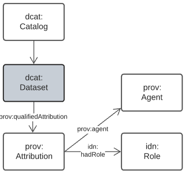
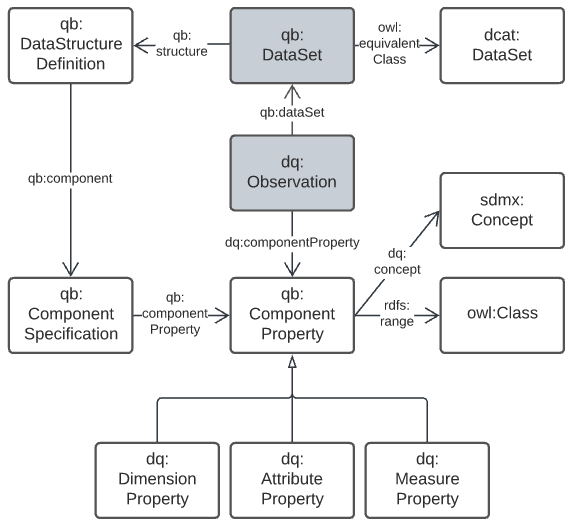
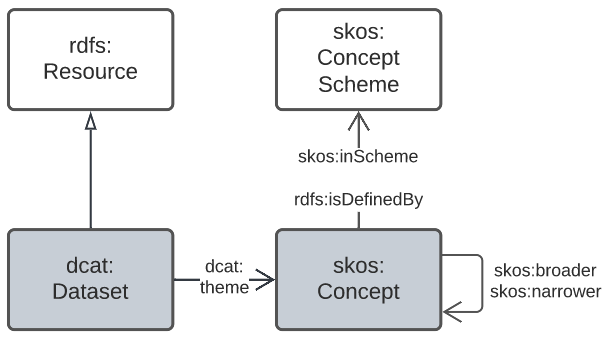
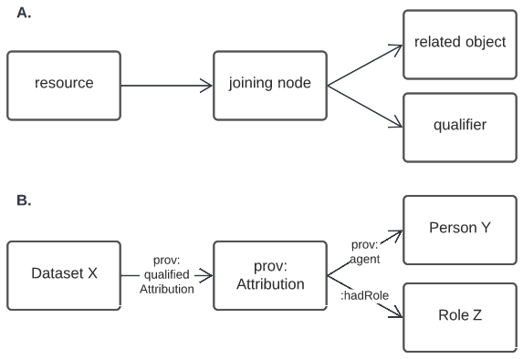
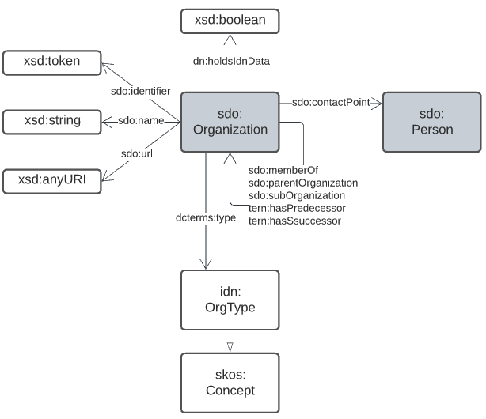

== Data Domains Details

The Data Domains described above are implemented using multiple models and other resources. The following subsections describe the Domains' details and link to all their resources.

=== Data Cataloguing Domain

This model is based on the _Data Catalog Vocabulary_ <<DCAT>> and _The Provenance Ontology_ <<PROV>> with extensions to cater for mappings to FAIR <<FAIR>> and CARE <<CARE>> models. The essential model is shown in <<datacataloguing-model, Figure 8>>.

[id=datacataloguing-model]
.Data Cataloguing Model, based on DCAT & PROV

=== Observations Domain

This domain is essentially the Data Cube Vocabulary <<DQ>>'s core elements with dataset metadata replaced with elements from DCAT <<DCAT>>. The essential model is shown in <<obs-model, Figure 9>>.

[id=obs-model]
.Observations Model, based on https://www.w3.org/TR/vocab-data-cube/#fig-pictorial-summary-of-key-terms-and-their-relationship[Data Cube Vocabulary overview]

=== Spatiality Domain

Spatiality is a concern for the IDN but not  aprimary concern as it is in other Supermodels such as the https://surroundaustralia.github.io/loci-supermodel/supermodel.html#_spatiality_domain[Loc-I Supermodel]. The IDN is aiming to be fully compatable with the Loc-I Supermodel such that any IDN spatial datasets are able to understood as Loc-I datasets and thus will be interoperable with other Loc-I Datasets. This will enable their use with the wider Loc-I spatial data.

=== Theming Domain

The purposes of characterising theming of data as a whole domain, rather than just applying it with _Data Cataloguing_, is to call it out as a major concern for IDN data beyond just cataloguing and to allow across allow for the full expression of sophisticated classification mecanisms.

The general mecahnisms for theming within this domain are standard, that is they follow patterns indicated in <<DCAT>> and <<SKOS>> used in many other models.

The DCAT pattern is, for whole catalogues, to identify _Knowledge Organization Systems_ (KOSes) and then, for idividual datasets, to categorise (theme) them using controlled themese from those KOSes. DCAT recommends the use of <<SKOS>> as a partisular KOS.

The general pattern for theming (classifying or categorising) datasets or other IDN objects is as per <<fig-theming-pattern, Figure 13>> where the <<DCAT>> `theme` property is used.

[fig-theming-pattern]
.The pattern of how themese (classifications / categories) are applied to Datasets and other IDN objects

A variation on this pattern is to use the Linked Data https://patterns.dataincubator.org/book/qualified-relation.html[_qualified relations pattern_] which 

[fig-theming-pattern]
.The Linked Data https://patterns.dataincubator.org/book/qualified-relation.html[_qualified relations pattern_] (A.) and an implementation of it for dataset attribution (B.)

==== Specific Themeing Resources

This Supermodel specifies the use of several specific SKOS vocabularies for data theming that express core classifications of interest to the IDN. Some of these vocabularies are widely used and the IDN has adopted them, others the IDN has created for its specific needs. The vocabularies are listed here but detailed in <<_annex_a_vocabularies>>. They are:

. <<ISO19115-1>>'s <<ISO19115-1 Role Codes, Role Codes>>
  * for `Agent` instances' roles in relation to `Dataset` instances
. <<Indigenous Data Governance Roles>>
  * for indigenous `Agent` roles in relation to `Dataset` instances
  * inspired by the Role Codes above

Use of th

=== Organisations & People Domain

This domain is essentially the organization modelling element of https://schema.org[schema.org] with a few additional properties to track some IDN-relevant aspects of an organisation. The essential model is shown in <<org-model, Figure 10>>.

[id=org-model]
.IDN Organisation Model, based on schema.org

