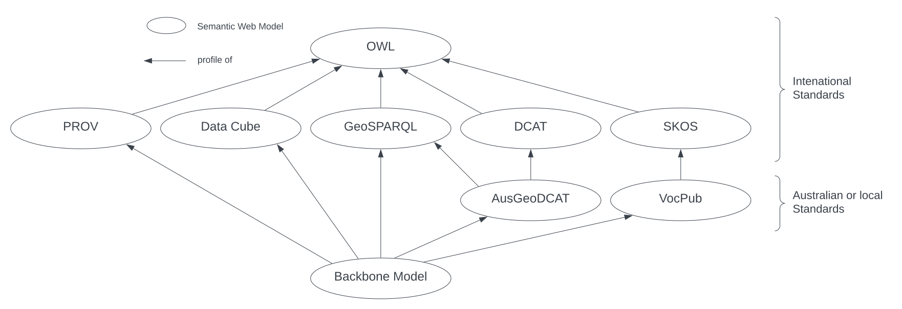

# Backbone Model

## Intro

The _Backbone Model_ of this Supermodel is the core model that all _Component Model_ instances must conform to. This means that all data in all _Component Model_ instances must pass the _Backbone Model_ validator.

This model is actually a _profile_ of some _Background Models_, that is, it doesn't introduce much novel modelling but instead just selects elements from existing models and mandates particular patterns of use, such as requiring certain properties to be present. 

For example, this Model profiles [PROV](background.md#the-provenance-ontology-prov), a well-known model used to represent the most general relations between processes, objects and causes, to provide relations between Datasets, People and Projects.

## Profile

This model is formally defined as a profile of a number of standards in the profile definition:

* [Backbone Model Profile Declaration](https://idn-au.github.io/nicholascar/idn-supermodel/blob/main/rdf/backbone/profile.ttl)

This can be summarised like this: 

1. The _Backbone Model_ is a profile of [PROV](background.md#the-provenance-ontology-prov), [Data Cube](background.md#data-cube-vocabulary), [AnzGeoDCAT](background.md#anzgeodcat) & [VocPub](background.md#vocpub) & [GeoSPARQL](background.md#geosparql) and, through them, [DCAT](background.md#dcat) & [SKOS](background.md#simple-knowledge-organization-system-skos). All of these are, in turn, profiles of [OWL](background.md#owl)
    1. see the figure below
2. It contains multiple profile resources:
    1. see the table below

This model's profile hierarchy is as follows:

<figure markdown>
    
  <figcaption>Figure BP: The Standards profiled by this Backbone Model</figcaption>
</figure>

This Model's resources and their roles are as follows:

**Resource** | **Role**
--- | ---
[Model Declaration](https://github.com/nicholascar/gsq-supermodel/blob/main/rdf/backbone/profile.ttl) | profile definition
this documentation | [Specification](https://www.w3.org/TR/dx-prof/#Role:guidance) & [Guidance](https://www.w3.org/TR/dx-prof/#Role:guidance)
[OWL Model](https://github.com/nicholascar/gsq-supermodel/blob/main/rdf/backbone/validator.ttl) | [Schema](https://www.w3.org/TR/dx-prof/#Role:schema)
[SHACL Validator](https://github.com/nicholascar/gsq-supermodel/blob/main/rdf/backbone/validator.ttl) | [Validation](https://www.w3.org/TR/dx-prof/#Role:validation)
[SHACL Validator - Compounded](https://github.com/nicholascar/gsq-supermodel/blob/main/rdf/backbone/validator-compounded.ttl) | [Validation](https://www.w3.org/TR/dx-prof/#Role:validation)
