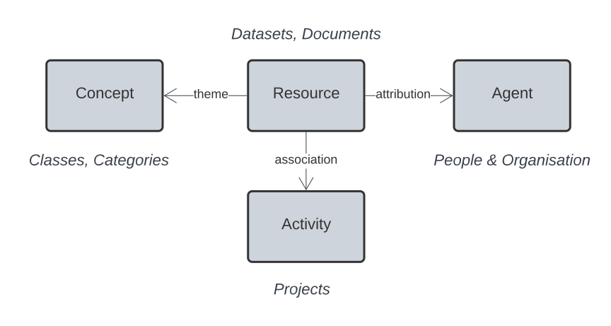

<h1>Indigenous Data Network's Supermodel</h1>

<figure markdown>
    
  <figcaption>Major elements of this Supermodel and their most basic relations.</figcaption>
</figure>

## About

This is a documentation website for a Supermodel: a multi-part Knowledge Graph data model.

This particular Supermodel is for information related to indigenous data managed by the [Indigenous Data Network](https://mspgh.unimelb.edu.au/centres-institutes/centre-for-health-equity/research-group/indigenous-data-network) within the [Indigenous Studies Unit](https://mspgh.unimelb.edu.au/centres-institutes/centre-for-health-equity/research-group/indigenous-studies) of the University of Melbourne.

This Supermodel both provides an integration framework for the IDN's own data and also a coordinated set of reference datasets for other organisations to use in characterising indigenous information.

Question      | Answer                          
----------- | ------------------------------------ 
Where is the IDN's Catalogue Profile? | See the [CP Component Model](components/cp.md)
What is a Supermodel, in detail?       | See [this Supermodel's description](supermodel.md) See the [generic description of a Supermodel](https://linked.data.gov.au/def/supermodel)
Other Supermodels? | See the [Related Supermodels](supermodel.md#related-supermodels) section of [this Supermodel's description](supermodel.md)

## License & Rights

This repository's content is available for reuse according to the [Creative Commons Attribution 4.0 International (CC BY 4.0)](https://creativecommons.org/licenses/by/4.0/).

This content is copyright as follows:

<em>&copy; Indigenous Data Network, 2023</em>

## Contacts

System Owner:

**Sandra Silcot**  
Indigenous Data Network  
*contact [via the IDN](https://mspgh.unimelb.edu.au/centres-institutes/centre-for-health-equity/research-group/indigenous-data-network)*

For technical matters, please contact:

**Nicholas Car**  
_Data Architect_ (contractor)  
[KurrawongAI](https://kurrawong.ai)  
<nick@kurrawong.ai>

