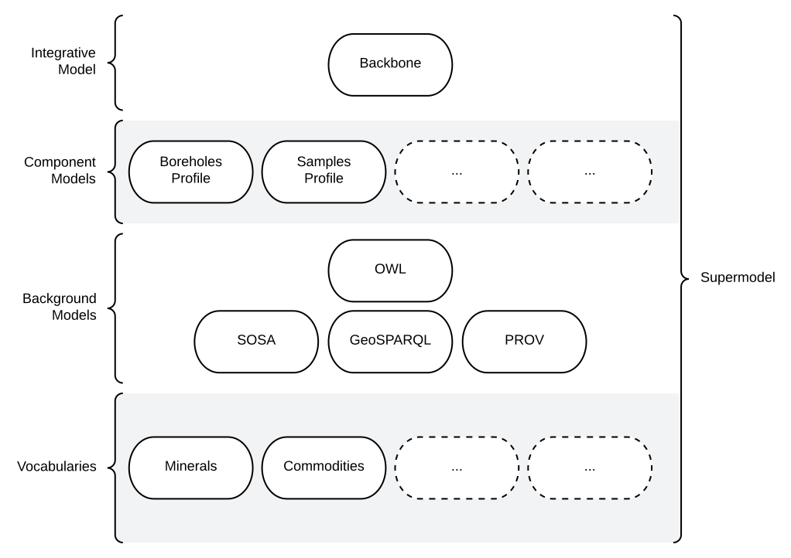

# The Supermodel

<figure markdown>
    
  <figcaption>Figure SMO: Informal overview of this Supermodel and its various parts.</figcaption>
</figure>

## Introduction

This "Supermodel" is a multi-part model that is used to coordinate expressions of data from multiple systems within the Indigenous Data Network (IDN). Specifically, this model allows for:

* integration of data across IDN systems
* alignment of IDN data with other data systems
    * for example, [Geoscience Australia's FSDF data](https://linked.data.gov.au/def/fsdf-supermodel)
* delivery of reference vocabs & models for indigenous data holders external to the IDN

The major parts of this Supermodel are shown in [Figure SMO](#the-supermodel) above.

### Related Supermodels

This Supermodel relates to several other Supermodels in existence including [Geoscience Australia's FSDF data](https://linked.data.gov.au/def/fsdf-supermodel) referenced above. The table below gives some details.

Supermodel | Relationship
--- | ---
[Foundational Spatial Data Framework Supermodel](https://linked.data.gov.au/def/fsdf-supermodel) | The FSDF Supermodel was created by [Geoscience Australia](https://www.ga.gov.au) to integrate multiple foundational spatial datasets within Australia. It specifies both a structure for spatial data and particular fundamental objects to join datasets with, such as authoritative boundaries for Australia and the states.<br /><br />This supermodel adopts the FSDF Supermodel ways of working for spatial data
[Spatial Information Queensland's Supermodel](https://github.com/Spatial-Information-QLD/supermodel) | A Supermodel for Queensland's state-managed spatial information, including Place Names and other administrative area<br /><br />This supermodel will likely reuse not just SIQ Supermodel models and vocabularies but perhaps instance data, such as specific place names.

## Supermodel Structure

The structure of this Supermodel follows the conventions of the _Supermodel Model_ defined at:

* <https://linked.data.gov.au/def/supermodel>

Each of the main parts of this Supermodel is listed on the left.

Individual data models - called _Component Models_ here - are given within the [Component Models Section](components.md).

## Modelling Conventions

All of the models within this Supermodel are visualised with informal OWL diagrams. These are diagrams that represent the Classes, Properties and Axioms of the [Web Ontology Language](background.md#web-ontology-language-owl) with the elements shown in Figure K below.

<figure markdown>
  
  <figcaption>Figure K: OWL Diagram Element Key</figcaption>
</figure>

## Technical Assets

All parts of this Supermodel are presented here in human-readable form (documentation) and also presented in machine-readable form for data validation and schema implementation. The machine-readable form for all parts is [Resource Description Framework (RDF)](https://www.w3.org/RDF/) files. Each part of this model's human-readable form provide links to the machine-readable form and the machine-readable form are also available in standard _Linked Data_ ways when accessing a Supermodel part via its individual identifier, i.e. you can request RDF for the Catalogue Profile Component Model via the following command using the Catalogue Profile's identifier:

```
~$ curl -L -H 'Accept: text/turtle' https://w3id.org/idn/def/cp
```

This command requests the RDF 'Turtle' format form of the Catalogue Profile. 